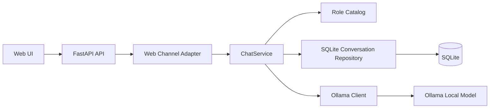
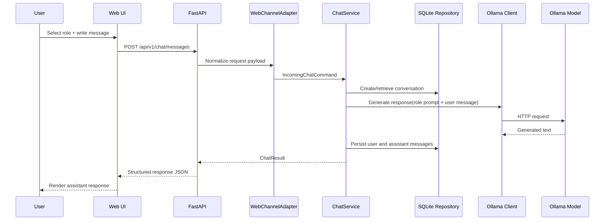

# Intelligent Role-Based Chat

An extensible chat application where the user selects a role before asking a question, and the system adapts the LLM prompt to respond with the expected tone, depth, and perspective.

This project is designed as a practical foundation for **role-driven conversational AI**, using **FastAPI**, **SQLite**, and **Ollama** for local inference. The current MVP includes a minimal web interface and a modular backend prepared for future channel integrations such as WhatsApp.

---

## Table of Contents

- [Project Overview](#project-overview)
- [Why This Project Exists](#why-this-project-exists)
- [Current Features](#current-features)
- [Architecture](#architecture)
- [Request Flow](#request-flow)
- [Tech Stack](#tech-stack)
- [Role Catalog](#role-catalog)
- [API Overview](#api-overview)
- [Project Structure](#project-structure)
- [Getting Started](#getting-started)
- [Configuration](#configuration)
- [Running the Application](#running-the-application)
- [Running Tests](#running-tests)
- [Current Limitations](#current-limitations)
- [Roadmap](#roadmap)
- [Development Workflow](#development-workflow)

---

## Project Overview

The application allows a user to:

1. Select a conversational role.
2. Send a message.
3. Route that message through a role-specific system prompt.
4. Generate a response through a local Ollama model.
5. Persist the conversation and message history in SQLite.

The goal is not only to provide a working chat experience, but also to demonstrate a clean and scalable architecture for **agentic role-based behavior** without prematurely over-engineering the system.

---

## Why This Project Exists

Most AI chat demos stop at “send prompt, get answer”. This project goes one step further by introducing **role-aware behavior** as a first-class concept.

That makes it useful for:

- **Academic evaluation**: demonstrates prompt engineering, local LLM usage, structured backend design, and persistence.
- **Portfolio presentation**: shows practical software architecture around AI instead of just UI wiring.
- **Future collaboration**: provides a maintainable base for adding channels such as WhatsApp without rewriting the conversation engine.

---

## Current Features

### Implemented in the MVP

- FastAPI backend serving API endpoints and static frontend assets
- Local persistence with SQLite
- Ollama integration through HTTP
- Minimal web UI for sending messages
- Fixed role catalog with four role profiles
- Role-specific system prompts
- Conversation and message history retrieval
- Centralized error handling with consistent API envelopes
- Base channel abstraction for future multi-channel support

### Included Roles

- `profesor`
- `programador`
- `psicologo`
- `negocios`

---

## Architecture

The system follows a **modular monolith** approach.

- **FastAPI** is the composition root and HTTP interface.
- **ChatService** is the application core.
- **SQLite repository** persists conversations and messages.
- **Ollama client** handles local LLM requests.
- **Channel adapters** normalize input depending on the transport.



### Architectural Intent

The current implementation deliberately keeps the system small, but the boundaries are already in place for future channel integrations. The important idea is this:

- **transport/channel concerns** should stay outside the core,
- while **conversation logic** remains reusable.

This is why the project already includes channel adapter contracts, even though the current production-ready flow is web-first.

---

## Request Flow

The core business flow is intentionally simple and traceable.



---

## Tech Stack

| Layer | Technology | Purpose |
|---|---|---|
| Backend API | FastAPI | HTTP API and static file serving |
| Web Server | Uvicorn | Local ASGI runtime |
| Persistence | SQLite | Lightweight storage for conversations and messages |
| ORM / DB Access | SQLAlchemy | Database models and repository implementation |
| LLM Integration | Ollama (HTTP) | Local model inference |
| HTTP Client | httpx | Calls to Ollama API |
| Settings | pydantic-settings | Environment-based configuration |
| Testing | pytest | Unit, integration, and contract tests |
| Frontend | HTML, CSS, JavaScript | Minimal browser-based chat UI |

---

## Role Catalog

The current role catalog is intentionally fixed and versioned in code.

| Role ID | Label | Behavior |
|---|---|---|
| `profesor` | Profesor | Explains concepts clearly, step by step, with simple examples |
| `programador` | Programador | Prioritizes technical accuracy, best practices, and useful code examples |
| `psicologo` | Psicólogo | Uses empathetic, careful, reflective language |
| `negocios` | Negocios | Focuses on strategy, impact, and actionable trade-offs |

These role definitions are implemented in:

- `backend/app/domain/roles.py`

---

## API Overview

### `GET /api/v1/health`

Returns a basic health status for the backend.

### `GET /api/v1/roles`

Returns the available role catalog.

Example response:

```json
[
  {
    "id": "profesor",
    "label": "Profesor",
    "description": "Explains clearly, step by step, with simple examples."
  }
]
```

### `POST /api/v1/chat/messages`

Sends a chat message through the role-aware conversation flow.

Example request:

```json
{
  "role": "programador",
  "message": "Explain dependency injection in FastAPI",
  "conversation_id": null
}
```

Example response:

```json
{
  "conversation_id": "uuid",
  "role": "programador",
  "channel": "web",
  "user_message": {
    "id": "uuid",
    "content": "Explain dependency injection in FastAPI",
    "created_at": "2026-04-18T00:00:00Z"
  },
  "assistant_message": {
    "id": "uuid",
    "content": "Dependency injection in FastAPI allows...",
    "created_at": "2026-04-18T00:00:01Z"
  },
  "model": "llama3.1"
}
```

### `GET /api/v1/chat/conversations/{conversation_id}/messages`

Returns the conversation history in chronological order.

---

## Project Structure

```text
.
├── backend/
│   ├── app/
│   │   ├── api/
│   │   │   ├── routes/
│   │   │   └── schemas/
│   │   ├── application/
│   │   │   ├── ports/
│   │   │   └── services/
│   │   ├── domain/
│   │   ├── infrastructure/
│   │   │   ├── channels/
│   │   │   ├── db/
│   │   │   └── llm/
│   │   ├── static/
│   │   ├── config.py
│   │   └── main.py
│   ├── tests/
│   │   ├── contract/
│   │   ├── integration/
│   │   └── unit/
│   ├── .env.example
│   └── requirements.txt
├── Chat_inteligente_con_roles.md
├── pytest.ini
└── README.md
```

---

## Getting Started

### Prerequisites

Make sure you have:

- **Python 3.11+**
- **Ollama** installed and running locally
- At least one local model available in Ollama

Recommended check:

```bash
ollama list
```

---

## Configuration

Copy the example environment file:

```bash
cp backend/.env.example backend/.env
```

Environment variables currently supported:

| Variable | Description | Default |
|---|---|---|
| `DATABASE_URL` | SQLite database connection string | `sqlite:///./chat_roles.db` |
| `OLLAMA_BASE_URL` | Base URL of the Ollama HTTP API | `http://localhost:11434` |
| `OLLAMA_MODEL` | Model name used for generation | `llama3.1` |
| `OLLAMA_TIMEOUT_SECONDS` | Timeout for model requests | `30` |

---

## Running the Application

### 1. Create and activate a virtual environment

```bash
python -m venv .venv
source .venv/bin/activate
```

### 2. Install dependencies

```bash
pip install -r backend/requirements.txt
```

### 3. Start the backend

```bash
uvicorn app.main:app --reload --app-dir backend
```

### 4. Open the web UI

Visit:

```text
http://127.0.0.1:8000/
```

---

## Running Tests

Run the full test suite from the project root:

```bash
pytest
```

The repository includes:

- **unit tests** for the conversation service
- **integration tests** for the API and SQLite repository
- **contract tests** for the Ollama adapter

---

## Current Limitations

This repository is intentionally scoped as an MVP.

### Not included yet

- Full WhatsApp integration with `bot-whatsapp`
- Authentication / authorization
- Admin panel
- Streaming responses
- RAG, embeddings, or vector databases
- Multimedia messaging support
- Production-grade observability and retry pipelines

### Important note about channels

The architecture is already prepared for future channel adapters, but the currently implemented production path is **web-first**.

---

## Roadmap

### Completed

- [x] Bootstrap FastAPI backend
- [x] Add role-aware conversation flow
- [x] Integrate Ollama through HTTP
- [x] Add SQLite persistence
- [x] Add minimal web interface
- [x] Add automated test suite

### Next logical steps

- [ ] Integrate WhatsApp through a dedicated Node bridge (`bot-whatsapp` + Baileys)
- [ ] Decouple adapter resolution from the hardcoded web runtime
- [ ] Add regression tests for multi-channel behavior
- [ ] Add smoke-test documentation for real Ollama execution

---

## Development Workflow

The repository is moving toward a stricter delivery workflow for upcoming features:

- Git branches per feature
- Issues per scoped change
- Pull requests for review
- Spec-driven development for meaningful changes

This keeps the project aligned with maintainable engineering practices as the system evolves from MVP to multi-channel architecture.

---

## Final Notes

This project is intentionally honest about its current state:

- it already demonstrates real AI application structure,
- it has a working role-based conversation flow,
- and it is prepared for future channel expansion,

but it does **not** pretend to be a finished multi-channel production platform yet.

That is a strength, not a weakness.

It means the foundation is being built correctly.
